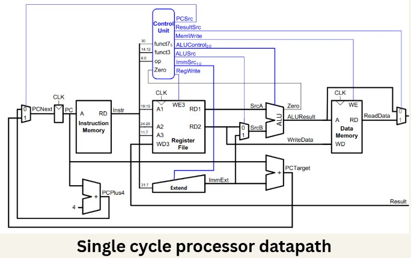
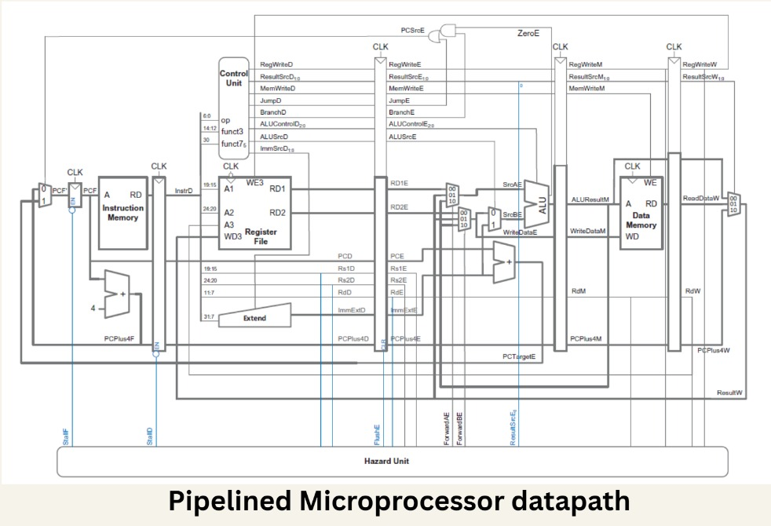

# 8-Bit Microprocessor Project  
### Single-Cycle & Pipelined RISC Processor in Verilog

This repository contains the implementation of a **custom 8-bit RISC-style microprocessor**, developed as a **team project**. The system includes both a **single-cycle processor** and a **5-stage pipelined processor with hazard handling**, along with a **custom assembler and assembly programs**.

The project demonstrates the **complete design flow of a processor**, from ISA design and hardware implementation to assembler development and program execution.

---

# Processor Architectures

## Single Cycle Processor

<p align="center">
  
</p>

The single-cycle processor executes every instruction in **one clock cycle**, making the datapath straightforward and easy to analyze.

### Key Components

- Program Counter (PC)
- Instruction Memory
- Control Unit
- Register File
- ALU
- Data Memory
- Sign Extender

This architecture was first implemented to validate the **ISA design and instruction execution flow** before extending the design into a pipelined processor.

---

## Pipelined Processor

<p align="center">
  
</p>

The pipelined processor improves throughput by executing multiple instructions simultaneously using a **5-stage pipeline**.

### Pipeline Stages

| Stage | Description |
|------|-------------|
| IF | Instruction Fetch |
| ID | Instruction Decode |
| EX | Execute |
| MEM | Memory Access |
| WB | Write Back |

### Additional Features

- **Forwarding Unit** for resolving data hazards
- **Hazard Detection Unit** for pipeline stalling
- **Pipeline Registers** between stages

---

# Repository Structure

| Folder / File | Description |
|---|---|
| [Assembler](./Assembler) | Python-based assembler to convert assembly code to machine code |
| [Modules](./Modules) | Modular Verilog components (ALU, Control Unit, Register File, etc.) |
| [NonPipelined](./NonPipelined) | Implementation of the **single-cycle microprocessor** |
| `Pipelined Processor with Hazard Unit/` | Full **5-stage pipelined processor implementation** |
| `Matrix Multiplication/` | Assembly-level matrix multiplication program |
| `Bonus Program 1/` | Additional test programs |
| `Final Synthesizable/` | Clean synthesizable Verilog modules |
| [FPGA implementation](./Bonus_SoC) | FPGA implementation |
| `Presentation/` | Project presentation materials |
| [README.md](./README.md) | Project documentation |

---

# Features

### Core Features

- Custom **8-bit Instruction Set Architecture**
- **Single-Cycle Processor Implementation**
- **5-Stage Pipelined Processor**
- **Hazard Detection and Forwarding**
- Modular Verilog-based hardware design
- Custom **Python assembler**

---

# Example Programs

The processor has been tested with multiple assembly programs including:

- Matrix Multiplication
- Arithmetic operation tests
- Memory load/store programs
- Additional benchmark programs

These programs verify:

- Instruction execution
- Register operations
- Memory access
- Pipeline hazard handling

---

# Tools Used

| Tool | Purpose |
|----|----|
| **Verilog HDL** | Hardware design |
| **Python** | Assembler implementation |
| **Vivado** | Simulation and synthesis |
| **Git / GitHub** | Version control |

---

# Usage Instructions

### Assemble a Program

```bash
cd Assembler/
python3 assembler.py program.asm
